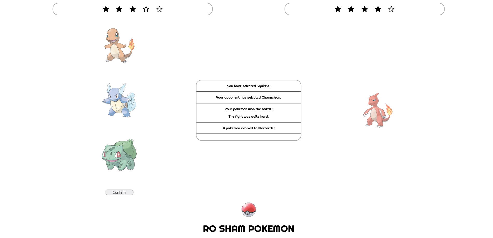

# Ro Sham Pokemon

Ro Sham Pokemon is a game similar to Rock Paper Scissors. The player and computer will each choose a Pokemon, among three, and then the winner will be determined based on the type and the level of the Pokemon.

## Table of contents
- [Related content](#related-content)
  - [Introduction](#introduction)
  - [Quick Exercises Before Starting](#quick-exercises-before-starting)
  - [Assignment](#assignment)
- [Screenshots](#screenshots)
- [Technologies](#technologies-and-tools)
- [Installation](#installation)
- [Demonstration](#demonstration)
- [Status](#status)
    - [Features](#features)
    - [Issues](#issues)
    - [Changelog](#changelog)
    - [To-do](#to-do)
- [Contributing](#contributing)
- [Licence](#licence)
- [Contact](#contact)

## Related content
[[The Odin Project](https://www.theodinproject.com) - [Foundations](https://www.theodinproject.com/paths/foundations/courses/foundations)] [Project: Rock Paper Scissors ](https://www.theodinproject.com/lessons/foundations-rock-paper-scissors)

### Introduction

We're going to make a simple implementation of grade-school classic "rock paper scissors". If you don't know what that is check the [Wikipedia article](https://en.wikipedia.org/wiki/Rock%E2%80%93paper%E2%80%93scissors) or [this](https://www.wikihow.com/Play-Rock,-Paper,-Scissors) ridiculous step-by-step. For the moment we're just going to play the game from the browser console, but __we will revisit this project in a later lesson and add a Graphical User Interface with buttons and text,__ so don't forget to keep the code on GitHub! You might notice some 'Live Preview' links in the student solutions that have a GUI - this is coming in a later lesson. When you get there don't forget to come back and add your link!

### Quick Exercises Before Starting

1. Identify three ways to include JavaScript in a page.
2. Test it out! Write `console.log("Hello World");` in JavaScript and check to see if it displays in the browser's console.

Finally, this is your first JavaScript program built from scratch, so don't forget the previous lesson on problem solving. Plan your solution out before writing any code, and test each piece as you build to ensure it is working before moving on to the next!

### Assignment

Don't forget to commit early & often! You can [reference the Commit Message lesson here](https://www.theodinproject.com/paths/foundations/courses/foundations/lessons/commit-messages)!

1. Start a new Git repo for your project.
2. Create a blank HTML document with a script tag (Hint: it is best practice to link an external .js file).  This game is going to be played completely from the console, so don't worry about putting anything else in there.
3. Your game is going to play against the computer, so begin with a function called `computerPlay` that will randomly return either 'Rock', 'Paper' or 'Scissors'.  We'll use this function in the game to make the computer's play. *Tip: use the console to make sure this is returning the expected output before moving to the next step!*
4. Write a function that plays a single round of Rock Paper Scissors.  The function should take two parameters - the `playerSelection` and `computerSelection` - and then return a string that declares the winner of the round like so: `"You Lose! Paper beats Rock"`
  1. Make your function's playerSelection parameter case-insensitive (so users can input `rock`, `ROCK`, `RocK` or any other variation).

5. **Important note:** you want to `return` the results of this function call, _not_ `console.log()` them. You're going to use what you `return` later on, so let's test this function by using console.log to see the results:

   ~~~javascript
   function playRound(playerSelection, computerSelection) {
     // your code here!
   }

   const playerSelection = "rock";
   const computerSelection = computerPlay();
   console.log(playRound(playerSelection, computerSelection));
   ~~~

6. Write a NEW function called `game()`. Call the `playRound` function _inside_ of this one to play a 5 round game that keeps score and reports a winner or loser at the end.
  1. [Remember loops?](https://www.theodinproject.com/lessons/foundations-problem-solving#solving-fizz-buzz) This is a great opportunity to use one to play those five rounds:

     ~~~javascript
     for (let i = 0; i < 5; i++) {
        // your code here!
     }
     ~~~

  1. At this point you should be using `console.log()` to display the results of each round and the winner at the end.
  1. Use `prompt()` to get input from the user. [Read the docs here if you need to.](https://developer.mozilla.org/en-US/docs/Web/API/Window/prompt)
  1. Feel free to re-work your previous functions if you need to. Specifically, you might want to change the return value to something more useful.
  1. Feel free to create more "helper" functions if you think it would be useful.

## Screenshots

## Technologies and tools

## Installation
Launch the project in your browser through the .html file.

## Demonstration
[Try it!](https://dyrits.github.io/RO-SHAM-POKEMON/)

## Status
The project has been completed.

### Features
The game is played against the computer. The player and computer will each choose a Pokemon, among the three first generation starters, and then the winner will be determined based on the type and the level of the Pokemon. The game ends after the player or computer wins 5 rounds. A Pokemon is able to evolve into a stronger Pokemon after winning a few rounds.

### Issues
There is no current issue with this project.
Feel free to open an issue if you have any questions or comments.

### Changelog

<strong>Version 1.02 (06/2022)</strong>

The images have been updated using local files.

<strong>Version 1.01 (06/2022)</strong>

The images have been updated. 
The name of the project has been changed to Ro Sham Pokemon. 
The README has been updated.

<strong>Version 1.00 (05/2020)</strong>

The first version of the project has been released.

### To-do
The project is complete and will not be updated further.

## Contributing
Pull requests are welcome. For major changes, please open an issue first to discuss what you would like to change.
Please make sure to update tests as appropriate (if any).

## Licence

## Contact
Created by [Dylan J. Gerrits](https://github.com/Dyrits).
